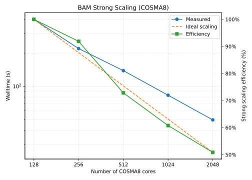
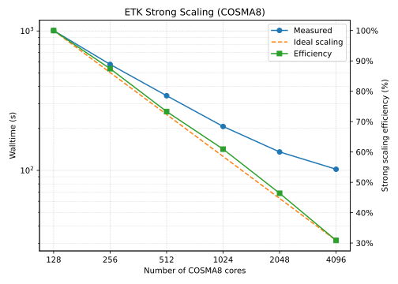
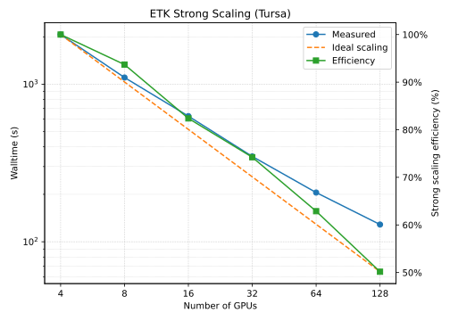
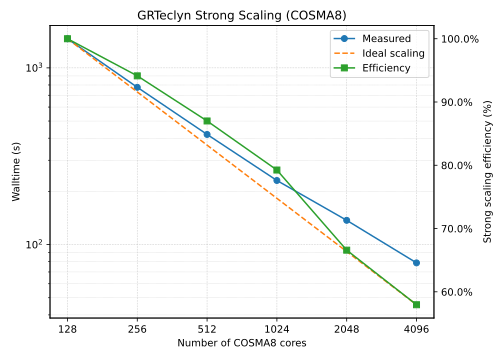
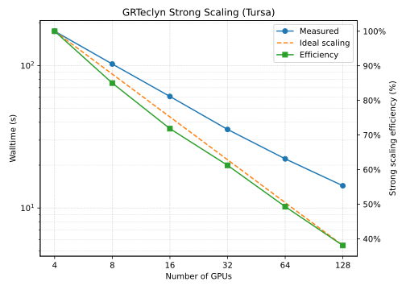
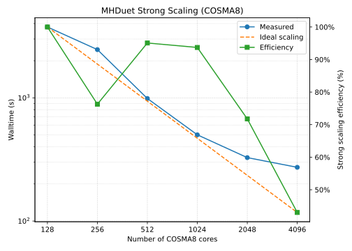
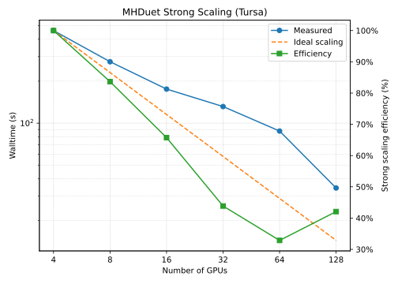

# Introduction

## Motivation

* There are many [3+1 NR codes]{.alert} that are being developed and/or used by
  the [UKNR community]{.alert}
  community.
* There have been some efforts to compare some of these codes but most of these
  have focused on just two codes and/or their results.
* If we are provided with funding to form a [full UKNR CCP]{.alert}, it's
  important to
  understand the current state of the codes that are being used:
  * What are their [methods and capabilities]{.alert}[^no-physics]?
  * How are they like to use/get started with?
  * For codes that are currently under active development, what is their current
    development status?
  * How do they perform?

## Limitations of this assessment

* Given finite time, there are many things we weren't able to investigate.
  A non-exhaustive list of these include:
  * Matter (we looked at vacuum BHs only)[^matter]
  * Testing out every feature and capability
  * Accuracy of the results
  * [Rigorous performance comparisons]{.alert} between the codes[^perf]
  * [Weak scaling]{.alert}
* Assessment is a [snapshot in time]{.alert} so subject to change.

[^matter]: Not all codes support the same types of matter hence why we focussed
on BHs.
[^perf]: To make performance comparisons fair, it would be necessary to
determine the configuration for each code to achieve the same accuracy.

## Criteria for assessment

Although there are many other codes that are used internationally, we have
chosen to only consider those that met the following criteria:

1. The code has some [relevance within the UKNR community]{.alert}. For example,
there is at least one developer based in the UK or there is a non-trivial
number of users.
1. The code is capable of evolving in [3+1 dimensions]{.alert} (i.e. it is not
dimensionally reduced and does not require the use of symmetries).
1. The code is capable of evolving a [binary black hole spacetime]{.alert}
through [inspiral, merger and ringdown]{.alert}.

This criteria is not exhaustive so we didn't include every code meeting this
criteria.

## The codes we investigated

Using the criteria described on the previous slide, we identified the following
codes:

* [BAM]{.alert}[^cardiff-version][^cpu-only]
* The [Einstein Toolkit]{.alert} (ETK)
  * with the Carpet driver (on CPUs)
  * with the CarpetX driver (on GPUs)
* [ExaGRyPE]{.alert}[^not-benchmarked]
* [GRTeclyn]{.alert}
* [MHDuet]{.alert} (AMReX version only)

[^cardiff-version]: We used the version of BAM used by Mark Hannam's group.
[^cpu-only]: Only tested on CPUs.
[^not-benchmarked]: This code was not benchmarked.

# The codes and their capabilities

## Common features

All of these codes use the following common methods:

* [Finite difference]{.alert} methods for spatial discretisation
* [Method of Lines]{.alert} for time integration
* [Mesh refinement]{.alert}
* 3+1 evolution systems: BSSN, CCZ4 or Z4c with some variant of the moving
  puncture gauge conditions
* Kreiss-Oliger dissipation
* Parallelised using the [Message Passing Interface (MPI)]{.alert}

## Code details {#slide-code-details}

Further details about each code can be found in the appendices linked below:

* [[BAM]{.button}](#bam-appendix)
* [[Einstein Toolkit]{.button}](#etk-appendix)
* [[ExaGRyPE]{.button}](#exagrype-appendix)
* [[GRTeclyn]{.button}](#grteclyn-appendix)
* [[MHDuet]{.button}](#mhduet-appendix)

# HPC resources

## COSMA8 {.smaller}

* [CPU-based]{.alert} DiRAC system hosted at Durham University.
* 528 compute nodes in total:
  * 360 nodes with AMD Rome/Zen 2 CPUs
  * 168 nodes with AMD Milan/Zen 3 CPUs
* We used the newer Milan nodes for benchmarking.
* Milan node specifications:
  * Dell PowerEdge C6525 server
  * 2x AMD EPYC 7763 CPUs, 64 cores each (128 total), 2.45 GHz base clock
  * 1 TB DDR4 RAM
  * 1x Mellanox ConnectX-6 HDR InfiniBand NIC, 200 Gbps
* [HDR200 InfiniBand]{.alert} network with a non-blocking fat-tree topology.

## Tursa {.smaller}

* [GPU-based]{.alert} DiRAC system hosted by EPCC at the University of
  Edinburgh.
* 178 compute nodes in total:
  * 114 nodes with Nvidia A100 40 GB GPUs
  * 64 nodes with Nvidia A100 80 GB GPUs
* We used the 80 GB A100 nodes for benchmarking.
* Node specifications:
  * Atos BullSequana XH2000 server
  * 2x AMD EPYC 7413 CPUs, 24 cores each (48 total), 2.65 GHz base clock
  * 4x Nvidia A100 SXM 80 GB GPUs with NVLink interconnect
  * 1 TB DDR4 RAM
  * 4x Mellanox ConnectX-6 HDR InfiniBand NICs, 200 Gbps each
* HDR200 InfiniBand network with a non-blocking 2-layer fat-tree topology.

# Qualitative setup and user experience

## BAM {.smaller}

:::: {.columns}

::: {.column width="50%"}
### Pros

* [Few dependencies]{.alert} and simple build system so easy to get set up with
  on a new
  system.
* Quick to build.
* Structure of the code is easy to understand and follow which makes
  modification straightforward.
* Familiar workflow:
  ```
  mpirun -n <num_procs> ./bam parfile.par
  ```
* Mature code with a long history of production simulations.
:::

::: {.column width="50%"}
### Cons

* [Private code]{.alert}
* Limited documentation
* Old style C requires some workaround with modern compilers
* No support for GPU offloading
:::

::::

## Einstein Toolkit {.smaller}

:::: {.columns}

::: {.column width="50%"}
### Pros

* [Open source]{.alert} with a large and active community.
* Extensive collection of thorns that provide lots of capabilities and
  flexibility.
* SimFactory2 provides a convenient abstraction layer for building and running
  simulations on supported HPC systems.
* Cactus thorn interface means that the process to adding new capabilities is
  standardised.
* Tutorials on how to get started.
* Some thorns have great documentation.
* Can print information about all parameters by doing
  ```
  ./cactus_sim --describe-all-parameters
  ```
* Many thorns are mature and have been used in many production simulations.
:::

::: {.column width="50%"}
### Cons

* [Large number of dependencies]{.alert} and complex build system.
* Slow to build (especially if using default release thornlist used).
* Difficult to set up on a new unsupported system.
* Some thorns have very little documentation.
* SimFactory2 workflow may be unfamiliar for those coming from other codes.
* CarpetX thorns are still under active development and much less mature than
  equivalent Carpet thorns.
* Had a very difficult time getting CarpetX to run on Tursa due to a bug but
  cannot be sure if this is a CarpetX or Tursa problem.
:::

::::

## ExaGRyPE {.smaller}

:::: {.columns}

::: {.column width="50%"}
### Pros

* [Open source]{.alert}
* Abstracted interface so scientific user shouldn't need to worry about
  technical details
* Python domain-specific language (DSL)
* Good connections with core developers
* Portability to different architectures
* Good documentation
:::

::: {.column width="50%"}
### Cons

* [Many parameters are hardcoded]{.alert} and not exposed to the
  user[^no-scaling].
* Non-standard workflow: no ability to change parameters at runtime.
* Only uses open GPU programming models (SYCL, OpenMP) which are often not
  first-party supported by GPU vendors and less performant than vendor-specific
  models (CUDA, HIP).
* GPU support finicky (development ongoing).
* Slightly difficult to debug build errors due to Python wrapper.
:::

::::

[^no-scaling]: This prevented us from performing scaling tests with ExaGRyPE.

## GRTeclyn {.smaller}

:::: {.columns}

::: {.column width="50%"}
### Pros

* [Open source]{.alert}
* Not too many dependencies so relatively straightforward to port to a new
  system
* Relatively quick to build
* Familiar workflow:
  ```
  mpirun -n <num_procs> <exe> <param_file>
  ```
* Robust GPU support from AMReX on Nvidia, AMD and Intel GPUs
* Good and improving documentation
:::

::: {.column width="50%"}
### Cons

* No standardised interface to add new capabilities like ETK
* Relatively new code so less mature than some others
* Some features are still under development and not yet available (e.g. Apparent
  Horizon Finder, GW extraction)
* Depends on AMReX which we have less control over.
:::

::::
## MHDuet {.smaller}

:::: {.columns}

::: {.column width="50%"}
### Pros

* [Simflowny code generation]{.alert} means it can be quicker for scientific
  users to get
  from new equations to code.
* Simflowny is open source
* Simple build system (just a single Makefile)
* Not too many dependencies (especially in the vacuum case)
* Robust GPU support from AMReX
* Familiar workflow:
  ```
  mpirun -n <num_procs> <exe> <param_file>
  ```
:::

::: {.column width="50%"}
### Cons

* Auto-generated code can be very verbose and difficult to read
* Can be slow to compile depending on problem size
* Build system is not very portable
* Non-trivial to add new capabilities that are not supported by Simflowny
* Depends on AMReX which we have less control over
:::

::::
# Scaling

## Setup and common configuration {.smaller}

* We only considered [strong scaling]{.alert} (i.e. increasing the
  computational resources
  for a fixed problem size).
* BH binary simulation with initial data based on the [GW150914 event]{.alert}.
* For an individual code, we used the same problem configuration for both CPU
  and GPU scaling tests[^etk-carpet-x] to make comparisons between them fairer.
* For each code, we started with a grid configuration that could be plausibly
  used in a production simulation and then iterated on the size of this grid
  until we found a configuration that saturated most of the RAM on a single
  COSMA8 node or a single Tursa node.
* Grid configurations therefore differ between codes but they are in a similar
  ballpark.
* We only evolved each code for a few timesteps on the coarsest level (with
  subcycling) and ignored time spent on initialization and finalization.
* We used each code's internal timing/profiling tools to measure the walltime of
  the main evolution loop.
* For all codes, the total mass in the simulation is $M \approx 1$ in code
  units.
* Parameter files, build and job submission scripts can be found in the
  [uknr-benchmarking
  repository](https://github.com/UKNumericalRelativity/uknr-benchmarking).
* On COSMA8, we used between 1 and 32 nodes (128 to 4096 cores).
* On Tursa, we used between 1 and 32 nodes (4 to 128 GPUs).

[^etk-carpet-x]: This is not true in the ETK case because of the change in mesh
refinement driver between CPU and GPU tests.

## BAM problem configuration

* 12 levels of mesh refinement (including coarsest level).
* 6 levels of fixed boxes and 6 levels of moving boxes.
* $320^2 \times 160$ points and $4400^2 \times 2200$ (bitant symmetry) length
  in code units on the coarsest level.
* $\sim 1/149$ resolution on the finest level.
* 2 timesteps on the coarsest level with subcycling from level 7 onwards
  ($t_{\text{end}} = 0.107421875$).
* Due to BAM's data distribution, we were only able to go up to
  [16 nodes]{.alert}
  (2048 cores) on COSMA8 (there was an error with 4096 cores).

## BAM scaling

{fig-align="center"}

## ETK problem configuration {.smaller}

:::: {.columns}

::: {.column width="50%"}
### Carpet CPU tests

* 10 levels of mesh refinement (including coarsest level).
* $320^2 \times 160$ points and $1024^2 \times 512$ (bitant symmetry) length in
  code units on the coarsest level.
* $1/160$ resolution on the finest level.
* Subcycling on all but the coarsest two levels.
* Terminate after 256 iterations (1 timestep on the coarsest level:
$t_{\text{end}} = 0.4$).
:::

::: {.column width="50%"}
### CarpetX GPU tests

* 10 levels of mesh refinement (including coarsest level).
* $288^3$ points and $1024^3$ length in code units on the coarsest level.
* Some issues with bitant symmetry hence not used.
* $1/144$ resolution on the finest level.
* Subcycling on all levels.
* Terminate after 512 iterations (1 timestep on the coarsest level:
  $t_{\text{end}} \approx 0.889$).
:::

::::

## ETK scaling

:::: {.columns}

::: {.column width="50%"}
{fig-align="center"}
:::

::: {.column width="50%"}
{fig-align="center"}
:::

::::

## GRTeclyn problem configuration

* 10 levels of mesh refinement (including coarsest level).
* $320^2 \times 160$ cells and $1024^2 \times 512$ (bitant symmetry) length in
  code units on the coarsest level.
* $1/160$ resolution on the finest level.
* Subcycling on all levels.
* 1 timestep on the coarsest level ($t_{\text{end}} = 0.8$).

## GRTeclyn scaling

:::: {.columns}

::: {.column width="50%"}
{fig-align="center"}
:::

::: {.column width="50%"}
{fig-align="center"}
:::

::::

## MHDuet problem configuration

* 10 levels of mesh refinement (including coarsest level).
* $256^3$ cells and $1024^3$ length in code units on the coarsest level.
* Fixed mesh refinement for the coarsest 6 levels with boxes of lengths: 1024,
  512, 256, 128, 64, 32
* $1/128$ resolution on the finest level.
* Subcycling on all levels.
* 1 timestep on the coarsest level ($t_{\text{end}} = 1.6$).

## MHDuet scaling

:::: {.columns}

::: {.column width="50%"}
{fig-align="center"}
:::

::: {.column width="50%"}
{fig-align="center"}
:::

::::

## All codes CPU scaling {.scrollable}

:::: {.columns}

::: {.column width="50%" .center}
{fig-align="center"}
{fig-align="center"}
:::

::: {.column width="50%" .center}
{fig-align="center"}
{fig-align="center"}
:::

::::

## All codes GPU scaling {.scrollable}

:::: {.columns}

::: {.column width="50%" .center}
{fig-align="center"}
:::

::: {.column width="50%" .center}
{fig-align="center"}
:::

::::

:::: {.columns}

::: {.column width="25%" .center}
:::

::: {.column width="50%" .center}
{fig-align="center"}
:::

::: {.column width="25%" .center}
:::

::::

# Conclusions

## Summary and future work

* We have explored the user experience and performance of some popular UKNR 3+1
  codes on CPU and GPU-based HPC systems.
* We will analyze the profiling data from the scaling tests to identify where
  time is being spent during simulations.
* We are writing a report on our findings which will be made publicly available
  and feed into the main UKNR scoping report.
* With greater time, we would have liked to have done the following:
  * Weak scaling analysis
  * Accuracy comparison between the codes of a full BBH simulation
  * Resources required to achieve the same accuracy

# Any questions?

# Appendices

## BAM {#bam-appendix}

* Written in (old-style) C with [pure MPI parallelisation]{.alert}
* [Very few dependencies]{.alert} (just a C compiler, Make, MPI, and optional
  HDF5)
* Originally written in the 1990s, it reached its current form
  in the mid-late 2000s and has not changed much since then.
* Node/vertex-centred with moving-box-style mesh refinement
* Berger-Oliger subcycling is used for most of the finer levels but disabled on
  coarser levels for stability.
* Sixth-order spatial differencing with eighth order KO dissipation

## BAM (continued)

* [BSSN evolution scheme]{.alert} with Sommerfeld BCs.
* Puncture tracking
* [Apparent Horizon finder]{.alert}
* Grid symmetries (e.g. bitant, quadrant, octant, etc.)
* Fourth or sixth order Lagrange polynomial interpolation of grid variables
* GW extraction via the Newman-Penrose formalism.

[[Return to code details]{.button}](#slide-code-details)

## Einstein Toolkit (ETK) {#etk-appendix .smaller}

* The Einstein Toolkit is built on the [Cactus Computational Toolkit
  (CCTK)]{.alert}
  software framework.
* A CCTK code comprises the Cactus _flesh_ with additional _thorns_ that
  implement a specific problem.
* The ETK is [not really a single code]{.alert} but rather a collection of
  thorns with the
  Cactus flesh that can be used for various problems.
* Thorns can be written in C, C++ or Fortran but they have a standardized
  interface to the flesh and other thorns.
* The recommended way to build, manage and run simulations is with the
  SimFactory2 thorn which provides an abstraction layer over different HPC
  systems. It requires the local system to be configured in its database.
* One of the core thorns is the _driver_ which implements the computational
  grid, mesh refinement (if relevant) and associated infrastructure.
* The most popular and well-supported driver is [_Carpet_]{.alert} which works
  on just
  CPUs.
  * Carpet supports OpenMP parallelisation.
* The next generation replacement for Carpet is [_CarpetX_]{.alert} which is
  built on the
  AMReX framework for block-structured AMR.
  * CarpetX supports OpenMP parallelisation and offloading to Nvidia GPUs via
    CUDA[^cuda-only].

[^cuda-only]: In principle, AMReX supports offloading to AMD and Intel GPUs via
HIP and SYCL respectively but this is not exposed by CarpetX yet.

## Einstein Toolkit - CPU tests {.smaller}

For our CPU tests, we used:

* A subset of the thorns from the [2025\_05 Kruskal ETK release]{.alert}.
* The Carpet driver.
* The McLachlan BSSN evolution thorn with Sommerfeld BCs.
* Eighth-order spatial differencing.
* Subcycling using buffer zones with fifth-order spatial prolongation
  (interpolation from coarse to fine) and second-order temporal prolongation.
* Moving-box style mesh refinement provided by the CarpetRegrid2 thorn.

This is loosely based on the GW150914 ETK gallery example but with the Llama
multipatch infrastructure removed (for fairer comparison with other codes).

## Einstein Toolkit - GPU tests {.smaller}

For our GPU tests, we used:

* [Recent development versions]{.alert} of the CarpetX and SpacetimeX thorn
  collections
  from Liwei Ji with subcycling support.
* The CarpetX driver.
* The Z4c evolution thorn from SpacetimeX
* Fourth-order spatial differencing.
* Subcycling with fifth-order prolongation.
* Moving-box style mesh refinement provided by the BoxInBox thorn.
* Sommerfeld BCs provided by the NewRadX thorn.

CarpetX is still [under active development]{.alert} and the software versions
used for
testing were not even merged into the main repositories so observations should
be interpreted with this caveat.

## Einstein Toolkit - additional capabilities {.smaller}

The ETK has an extensive list of additional capabilities some of which have
multiple implementations via different thorns. These include (but are by far not
limited to):

* Multipatch support with "cubed sphere" outer patches (Llama infrastructure for
  Carpet and CapyrX infrastructure for CarpetX).
* Puncture tracking (PunctureTracker thorn).
* Apparent Horizon finding (AHFinder, AHFinderDirect, ET_BHaHAHA thorns).
* GW extraction via the NP formalism (WeylScal4, NPScalar and Multipole thorns).
* Lagrange polynomial interpolation of grid variables (CarpetInterp2 and
  AEILocalInterp thorns for Carpet and core capability for CarpetX).
* Reflection and rotational grid symmetries.
* Output of data that can be used with the SpECTRE Cauchy Characteristic
  Extraction code provided by the CCE_Export thorn.

Note that many Carpet-compatible thorns have been rewritten to support CarpetX
and are often renamed by appending with an "X" (e.g. TwoPunctures $\to$
TwoPuncturesX)

[[Return to code details]{.button}](#slide-code-details)

## ExaGRyPE {#exagrype-appendix .smaller}

* ExaGRyPE is an NR code built upon [ExaHyPE 2]{.alert} (second generation
  Exascale
  Hyperbolic PDE Engine) which in turn is built upon the Peano framework for
  solvers on dynamical adaptive Cartesian meshes.
* ExaGRyPE, ExaHyPE 2 and Peano are written in a mix of C++ and Python.
* To build a simulation executable, a Python script is invoked with simulation
  parameters passed as arguments (which cannot be changed at runtime).
* ExaGRyPE uses a mix of [domain decomposition]{.alert} and
  [task-based parallelism]{.alert}:
  * MPI is used for domain decomposition
  * On CPUs, Peano/ExaHyPE 2 supports task-based parallelism via C++ standard
    library threading, Intel Threading Building Blocks (TBB), OpenMP and SYCL.
  * On GPUs, they support offloading via SYCL and OpenMP (vendor-agnostic).
  * Note that ExaGRyPE support for these programming models is not yet
  guaranteed.
* Cell-centred grid with [spacetree]{.alert}[^spacetree] AMR.
* Fourth-order spatial differencing with sixth-order KO dissipation.
* First-order explicit time integration is generally used but RK4 is also
  supported.
* Trilinear spatial prolongation and averaging for restriction (interpolation
  from fine to coarse).

[^spacetree]: In the case of a refinement ratio of 2, spacetree is often called
octree. ExaGRyPE uses a ratio of 3.

## ExaGRyPE (continued)

* CCZ4 evolution scheme which is recast as first-order-in-space so there are 58
  evolved variables. Algebraic constraints are enforced.
* Sommerfeld BCs.
* Bowen-York initial data provided by TwoPunctures.
* Trilinear interpolation from grid variables onto particle tracers
* GW extraction via the NP formalism using the above particle tracer
  interpolation.
* Puncture tracking using the particle tracer interpolation.

[[Return to code details]{.button}](#slide-code-details)

## GRTeclyn {#grteclyn-appendix .smaller}

* Written in [modern C++]{.alert}.
* Built upon and integrated with the [AMReX framework]{.alert} for
  block-structured AMR.
* Successor to GRChombo which was built on the Chombo AMR libraries
* Few dependencies: C++20 compiler (with GPU support if required), GNU Make, MPI
  and AMReX.
* [MPI+X]{.alert} parallelized with X is OpenMP, CUDA (on Nvidia GPUs), HIP (on
  AMD GPUs)
  or SYCL (on Intel GPUs).
* Cell-centred grid with block-structured AMR.
* Arbitrary mesh refinement criteria but something emulating moving boxes is
  typically used on the finest few levels for BH binaries.
* Fourth-order spatial differencing with sixth-order KO dissipation.
* Fourth-order spatial prolongation, third-order temporal prolongation and
  fourth-order restriction.

## GRTeclyn (continued)

* CCZ4 evolution scheme with Sommerfeld BCs and algebraic constraint
  enforcement
* Puncture tracking
* Lagrange polynomial interpolation of grid variables using AMReX particle
  infrastructure (usually fourth order)
* GW extraction via the NP formalism using above interpolation
* Grid symmetries (e.g. bitant, quadrant, etc)

[[Return to code details]{.button}](#slide-code-details)

## MHDuet {#mhduet-appendix .smaller}

* MHDuet is a code that is [automatically generated]{.alert} using the Simflowny
  infrastructure.
* To generate a code using Simflowny, the scientific user needs to provide the
  following information in MathML format (typically generated using a Maple
  script):
  * Evolution equations
  * Initial conditions
  * Boundary conditions
  * Discretisation scheme
* The generate code is built on either the SAMRAI or AMReX libraries. We focus
  on the AMReX version from now on.
* The generated code is written in C++ and parallelized with MPI+X where X is
  OpenMP, CUDA (on Nvidia GPUs) or HIP (on AMD GPUs).
* Mainly focused on MHD spacetimes rather than vacuum BHs.
* Relatively small number of dependencies in the vacuum case (similar to
  GRTeclyn but also with HDF5) but more in the MHD case (which we don't
  consider).

## MHDuet (continued) {.smaller}

* Node/vertex-centred grid with block-structured AMR
* Fixed mesh refinement in the form of concentric boxes is typically used on
  coarser levels.
* On finer levels, function-based refinement and shadow-based refinement are
  supported.
* Fourth-order spatial differencing with sixth-order KO dissipation
* Fifth order spatial prolongation and third-order temporal prolongation
* CCZ4 evolution scheme with algebraic constraint violations damped.
* Extrapolating BCs are typically used.-
* Various reductions of grid variables can be computed (e.g. sums, extrema,
  norms, integrals, etc.)
* Linear interpolation of grid variables on spheres and planes for diagnostics
  and GW extraction.

[[Return to code details]{.button}](#slide-code-details)